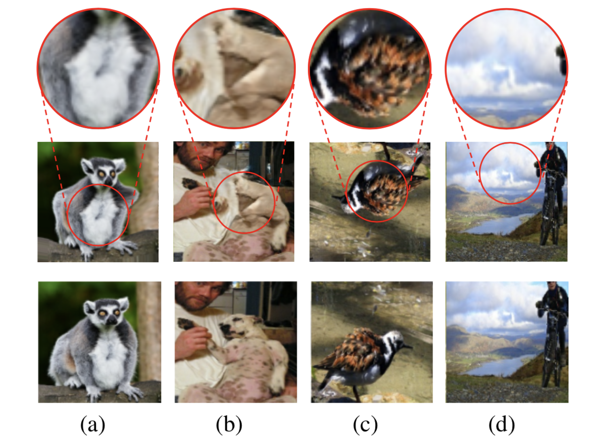
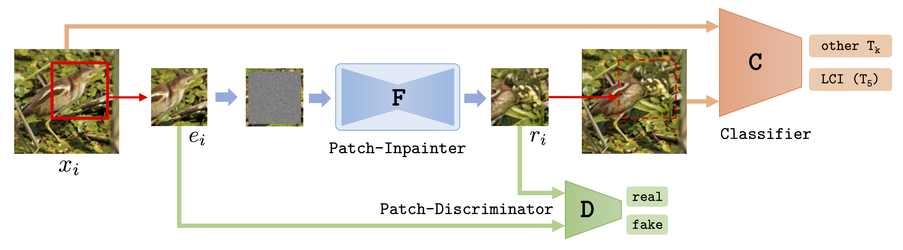

    

*Examples of local patches from images that were (a) warped, (b) locally inpainted,  (c) rotated or (d) not transformed.  The bottom row shows the original images, the middle row shows the corresponding transformed images and the top row shows a detail of the transformed image.  By only observing a local patch (top row), is it possible in all of the above cases to tell if and how an image has been transformed or is it instead necessary  to  observe  the  whole  image  (middle  row), i.e., the global pixel statistics?*

# Abstract

We introduce a novel principle for self-supervised feature learning based on the discrimination of specific transformations of an image. 
We argue that the generalization capability of learned features depends on what image neighborhood size is sufficient to discriminate different image transformations: The larger the required neighborhood size and the more global the image statistics that the feature can describe. An accurate description of global image statistics allows to better represent the shape and configuration of objects and their context, which ultimately generalizes better to new tasks such as object classification and detection.
This suggests a criterion to choose and design image transformations. 
Based on this criterion, we introduce a novel image transformation that we call limited context inpainting (LCI).
This transformation inpaints an image patch conditioned only on a small rectangular pixel boundary (the limited context). Because of the limited boundary information, the inpainter can learn to match local pixel statistics, but is unlikely to match the global statistics of the image.
We claim that the same principle can be used to justify the performance of transformations such as image rotations and warping.
Indeed, we demonstrate experimentally that learning to discriminate transformations such as LCI, image warping and rotations, yields features with state of the art generalization capabilities on several datasets such as Pascal VOC, STL-10, CelebA, and ImageNet. Remarkably, our trained features achieve a performance on Places on par with features trained through supervised learning with ImageNet labels.

# Model & Code

*Training of the Limited Context Inpainting (LCI) network. A random patch is extracted from a training image x and all but a thin border of pixels are replaced by random noise.  The inpainter network F fills the patch with realistic textures conditioned on the remaining border pixels. The resulting patch is replaced back into the original image, generating an image with natural local statistics, but unnatural global statistics.*

  <b style="font-size: 20px">Code:</b> 
  <a href="https://github.com/sjenni/LCI" style="font-size: 20px; text-decoration: none">[GitHub]</a>

